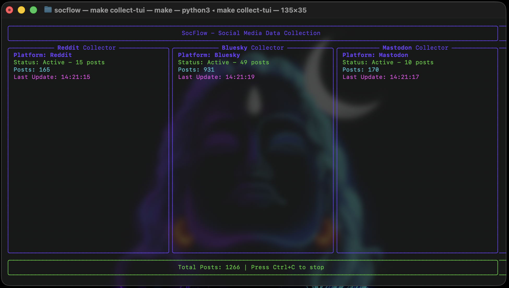

# 🧩 SocFlow

**SocFlow** is a unified framework for collecting and analyzing public discourse from multiple social platforms such as **Reddit**, **Bluesky**, and **Mastodon**.  
It helps researchers and developers build large-scale social datasets for sentiment analysis, topic modeling, and behavioral studies.

[](https://www.python.org/downloads/)
[](https://opensource.org/licenses/MIT)
[](https://github.com/psf/black)

## 🖥️ TUI Demo



*Real-time data collection from Reddit, Bluesky, and Mastodon with split-screen monitoring*

## 🚀 Features

- **🖥️ Terminal User Interface (TUI)**: Real-time split-screen monitoring of all platforms
- **🔄 Continuous Collection**: Collect data continuously until interrupted
- **🎯 Keyword-Based Collection**: Filter posts by keywords and hashtags
- **📊 Real-Time Statistics**: Live updates of collection progress and metrics
- **🛡️ Data Deduplication**: Prevents storing duplicate posts across collection cycles
- **⚡ Parallel Processing**: Simultaneous collection from multiple platforms
- **🏗️ Object-Oriented Design**: Clean, modular architecture with reusable components
- **⚙️ Hierarchical Configuration**: Dev and user-level configuration management
- **🗄️ Database Flexibility**: Choose between single or separate databases per platform
- **✅ Pydantic Validation**: Type-safe data models with automatic validation
- **📱 Multiple Platforms**: Reddit, Bluesky, and Mastodon support
- **🔗 Unified Schema**: Consistent data structure across all platforms
- **🖥️ CLI Interface**: Easy-to-use command-line interface
- **📤 Export Options**: JSON, CSV, and Parquet export formats

## ⚙️ Installation

### Quick Setup (Recommended)

```bash
# Clone the repository
git clone https://github.com/gauravfs-14/socflow.git
cd socflow

# Complete setup with one command
make setup
```

### Manual Setup

```bash
# Create a virtual environment
uv venv
source .venv/bin/activate

# Install dependencies
uv sync

# Setup environment and configuration
make setup-env
make setup-config
```

## 🧠 Quick Start

<details>
<summary>📋 Click to expand Quick Start Guide</summary>

### 1. Environment Setup

```bash
# Copy environment template
cp .env.example .env

# Edit .env with your API credentials
nano .env
```

### 2. API Credentials Setup

```bash
# Setup credentials interactively
make setup-credentials
```

### 3. Database Setup

```bash
# Create database tables
make setup-db
```

### 4. Start Data Collection

```bash
# Launch TUI for real-time collection
make collect-tui

# Or collect from specific platforms
make collect-reddit
make collect-bluesky
make collect-mastodon
```

### 5. View Results

```bash
# Show collection statistics
make stats

# Export data
make export-json
```

</details>

## 🖥️ Terminal User Interface (TUI)

The TUI provides a real-time split-screen interface for monitoring data collection across all platforms:

### Features

- **📊 Live Statistics**: Real-time post counts and collection status
- **⏱️ Timestamps**: Last update times for each platform
- **🔄 Continuous Updates**: Automatic refresh of collection progress
- **🛑 Graceful Shutdown**: Ctrl+C to stop all collection processes
- **📈 Progress Tracking**: Visual indicators for collection status

### Usage

```bash
# Launch TUI
make collect-tui

# The TUI will show:
# - Reddit Collector: Status, posts collected, last update
# - Bluesky Collector: Status, posts collected, last update  
# - Mastodon Collector: Status, posts collected, last update
```

## 🏗️ Architecture

<details>
<summary>🏛️ Click to expand Architecture Details</summary>

### Configuration Management

- **Dev Config**: `config/settings.yml` - Development settings
- **User Config**: `~/.socflow/config.yml` - User-specific settings
- **Environment Variables**: Override any setting via environment variables

### Database Options

- **Single Database**: All platforms in one database (default)
- **Separate Databases**: One database per platform
- **Supported Types**: SQLite (default), PostgreSQL, MySQL

### Data Models

- **BasePost**: Common interface for all platforms
- **Platform-Specific Models**: RedditPost, BlueskyPost, MastodonPost
- **Pydantic Validation**: Automatic data validation and serialization

### Collection Flow

```
┌─────────────┐    ┌──────────────┐    ┌─────────────┐
│   Reddit    │    │   Bluesky    │    │  Mastodon   │
│  Collector  │    │  Collector   │    │  Collector  │
└─────┬───────┘    └──────┬───────┘    └─────┬───────┘
      │                   │                   │
      └───────────────────┼───────────────────┘
                         │
                  ┌──────▼──────┐
                  │   Database  │
                  │  Manager   │
                  └────────────┘
```

</details>

## 🧩 Configuration

<details>
<summary>⚙️ Click to expand Configuration Options</summary>

### Database Configuration

```yaml
database:
  type: "sqlite"  # sqlite, postgresql, mysql
  path: "data/socflow.db"
  separate_databases: false  # true for separate DBs per platform
```

### Reddit Configuration

```yaml
collectors:
  reddit:
    enabled: true
    subreddits: ["all", "MachineLearning", "worldnews", "politics"]
    max_posts_per_subreddit: 999999
    sort_by: "hot"  # hot, new, top, rising
    time_filter: "day"  # hour, day, week, month, year, all
```

### Bluesky Configuration

```yaml
collectors:
  bluesky:
    enabled: true
    keywords: []  # Empty for timeline collection
    max_posts: 999999
```

### Mastodon Configuration

```yaml
collectors:
  mastodon:
    enabled: true
    instances: ["https://mastodon.social", "https://mastodon.technology"]
    hashtags: []  # Empty for public timeline collection
    max_posts_per_instance: 999999
```

### Environment Variables

```bash
# Reddit API
REDDIT_CLIENT_ID=your_client_id
REDDIT_CLIENT_SECRET=your_client_secret

# Bluesky
BLUESKY_HANDLE=your_handle.bsky.app
BLUESKY_PASSWORD=your_password

# Mastodon
MASTODON_ACCESS_TOKEN=your_access_token
```

</details>

## 🗃️ Unified Schema

<details>
<summary>📊 Click to expand Data Schema Details</summary>

Each collected post is normalized into a common structure:

| Field           | Description                             |
| --------------- | --------------------------------------- |
| `platform`      | Source platform (reddit, bluesky, etc.) |
| `object_id`     | Unique ID per platform                  |
| `author_handle` | Username or handle                      |
| `text`          | Post or comment text                    |
| `created_at`    | Timestamp                               |
| `tags`          | Hashtags or communities                 |
| `metrics`       | Likes, shares, upvotes, etc.            |
| `url`           | Link to the original post               |

### Platform-Specific Fields

**Reddit**:

- `subreddit`, `title`, `flair`, `is_self`, `is_nsfw`
- `upvotes`, `downvotes`, `score`, `gilded`

**Bluesky**:

- `handle`, `display_name`, `is_reply`, `is_repost`
- `likes`, `reposts`, `replies`, `quotes`

**Mastodon**:

- `instance`, `is_reblog`, `is_sensitive`
- `favourites`, `reblogs`, `replies`, `bookmarks`

</details>

## 🚀 Usage

<details>
<summary>🛠️ Click to expand Usage Examples</summary>

### Makefile Commands (Recommended)

The project includes a comprehensive Makefile for easy usage:

```bash
# Show all available commands
make help

# Complete project setup
make setup

# Data collection
make collect-tui          # Launch TUI for real-time collection
make collect-reddit       # Collect from Reddit
make collect-bluesky      # Collect from Bluesky  
make collect-mastodon     # Collect from Mastodon
make collect-all          # Collect from all platforms

# Data management
make stats                # Show statistics
make export-json          # Export as JSON
make export-csv           # Export as CSV
make export-parquet       # Export as Parquet

# Configuration
make config               # Show current config
make setup-env            # Setup environment file
make setup-credentials    # Setup API credentials
make setup-db             # Create database tables
```

### CLI Commands

```bash
# Collect data from Reddit
python -m src.main collect --platforms reddit --subreddits all

# Collect data from Bluesky
python -m src.main collect --platforms bluesky --keywords AI machinelearning

# Collect data from Mastodon
python -m src.main collect --platforms mastodon --hashtags AI tech

# Collect from all platforms
python -m src.main collect --platforms reddit bluesky mastodon

# Show statistics
python -m src.main stats --platform reddit

# Export data
python -m src.main export --output data/export.json --platform reddit

# Show configuration
python -m src.main config
```

### Programmatic Usage

```python
from src.app import SocFlowApp

# Initialize app
app = SocFlowApp("config/settings.yml")

# Create tables
app.create_tables()

# Collect data
results = app.collect_data(platforms=["reddit"])

# Get statistics
stats = app.get_stats()

# Export data
app.export_data("data/export.json")

# Cleanup
app.close()
```

</details>

## 🔧 Development

<details>
<summary>🛠️ Click to expand Development Guide</summary>

### Project Structure

```
src/
├── app.py              # Main application and CLI
├── tui.py              # Terminal User Interface
├── config/             # Configuration management
│   └── settings.py
├── models/             # Pydantic data models
│   ├── base.py
│   ├── reddit.py
│   ├── bluesky.py
│   └── mastodon.py
├── database/           # Database abstraction
│   ├── base.py
│   ├── sqlite.py
│   └── factory.py
├── collectors/         # Data collectors
│   ├── base.py
│   ├── reddit.py
│   ├── bluesky.py
│   └── mastodon.py
└── utils/              # Utilities
    └── logger.py
```

### Adding New Platforms

1. Create a new collector class inheriting from `BaseCollector`
2. Create platform-specific data models
3. Update the database schema if needed
4. Register the collector in the main application

### Adding New Database Types

1. Create a new database manager inheriting from `DatabaseManager`
2. Implement all abstract methods
3. Update the factory function
4. Add configuration options

### Development Commands

```bash
# Install development dependencies
make install

# Run tests
make test

# Format code
make format

# Run linting
make lint

# Clean up
make clean
```

</details>

## 📊 Performance & Optimization

<details>
<summary>⚡ Click to expand Performance Details</summary>

### Collection Performance

- **Reddit**: ~15 posts per 2-3 seconds
- **Bluesky**: ~50-100 posts per collection cycle
- **Mastodon**: ~20-30 posts per collection cycle

### Optimization Features

- **Batch Processing**: Efficient batch collection and database insertion
- **Deduplication**: Prevents storing duplicate posts
- **Parallel Collection**: Simultaneous collection from multiple platforms
- **Memory Management**: Optimized memory usage for large datasets

### Database Optimization

- **Indexed Fields**: Optimized database indexes for fast queries
- **Connection Pooling**: Efficient database connection management
- **Transaction Batching**: Batch database operations for better performance

</details>

## 🐛 Troubleshooting

<details>
<summary>🔧 Click to expand Troubleshooting Guide</summary>

### Common Issues

**Reddit not collecting:**

```bash
# Check Reddit credentials
make setup-credentials

# Test Reddit collector directly
python -c "from src.app import SocFlowApp; app = SocFlowApp(); print(app.collectors['reddit'].is_enabled())"
```

**Database connection issues:**

```bash
# Recreate database
rm -rf data/socflow.db
make setup-db
```

**TUI not displaying properly:**

```bash
# Check terminal size
echo $COLUMNS $LINES

# Try different terminal
export TERM=xterm-256color
```

### Debug Mode

```bash
# Enable debug logging
export SOCFLOW_DEBUG=1
make collect-tui
```

### Performance Issues

```bash
# Check system resources
htop

# Monitor database size
ls -lh data/socflow.db

# Check collection logs
tail -f logs/socflow.log
```

</details>

## 🤝 Contributing

We welcome contributions! Please see our [Contributing Guide](CONTRIBUTING.md) for details.

### Quick Contribution Steps

1. Fork the repository
2. Create a feature branch
3. Make your changes
4. Add tests
5. Submit a pull request

## 📜 Code of Conduct

Please read our [Code of Conduct](CODE_OF_CONDUCT.md) to understand our community guidelines.

## 📄 License

This project is licensed under the MIT License - see the [LICENSE](LICENSE) file for details.

## 🙏 Acknowledgments

- **Reddit API**: [PRAW](https://praw.readthedocs.io/) for Reddit data access
- **Bluesky API**: [atproto](https://atproto.com/) for Bluesky integration
- **Mastodon API**: [Mastodon.py](https://mastodonpy.readthedocs.io/) for Mastodon support
- **TUI Framework**: [Rich](https://rich.readthedocs.io/) for beautiful terminal interfaces
- **Data Validation**: [Pydantic](https://pydantic-docs.helpmanual.io/) for type-safe data models

## 📞 Support

- **Issues**: [GitHub Issues](https://github.com/gauravfs-14/socflow/issues)
- **Discussions**: [GitHub Discussions](https://github.com/gauravfs-14/socflow/discussions)

---

**Made with ❤️ by [Gaurab Chhetri](https://github.com/gauravfs-14)**
